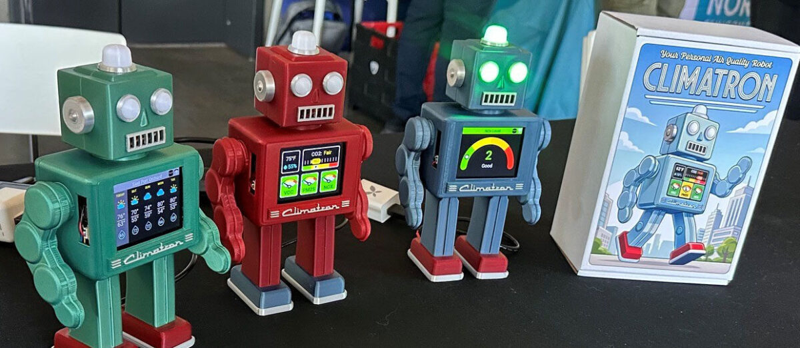
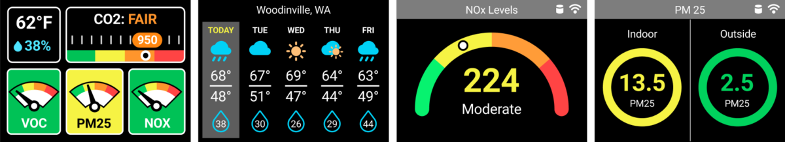

	<h1>climatron</h1>
	<h3>Your Personal Air Quality Robot</h3>

The [Climatron Project](https://climatron.io) aims to make monitoring environmental air quality around
you easy, informative, and fun by blending a modern array of sensors with a
convenient touchscreen display, open source hardware and software, and a special fondness for [toy robots](https://tintoyrobots.com/).

Climatron uses a Sensirion SEN-66 sensor to sample its surroundings, measuring temperature, humidity, carbon dioxide levels, airborne particulates, nitrous oxide, and volatile organic compounds. Current values as well as graphs of recent measurements are available through the built-in touchscreen color display, along with a five-day weather forecast for the current location. Overall indication of air quality for each environmental factor is provided through LEDs built into the unit's head, ranging from green for good through yellow, orange and red for fair, poor and bad respectively. 

Here's a sample of Climatron's user interface (which you can also see in the photo above).

